# MCP & Observability Integration: Architectural Synthesis

This document synthesizes the design principles of **OpenEnv Invariants**, the technical primitives of **FastMCP 3.0**, and our current **Med-Safety-Gym Observability Hub** into a unified architecture for context-aware, sandboxed agent evaluation.

---

## 1. The "Dual API" Invariant & Our Hub
OpenEnv specifies a strict boundary between the **Agent** (MCP) and **Infrastructure** (Gym-like HTTP). 

### How we align:
- Our **RubricObserver** currently acts as the bridge. It observes the agent's actions (via the Gym `step` loop) and broadcasts them to the Hub.
- **The Synthesis**: In a fully MCP-native world (FastMCP 3), our **Observability Hub** should be exposed as an **MCP Provider** for evaluators, but kept hidden from the active agent. This preserves the invariant: *The agent sees tools; the system sees trajectories.*

---

## 2. FastMCP 3.0 Primitives as Infrastructure
FastMCP 3's core primitives (Providers, Components, Transforms) provide a more robust way to implement our current observer logic.

### Observability as a "Transform"
Currently, we use `RubricObserver` hooks to capture data. With FastMCP 3, we can use **Transforms**:
- **Tool Tracing**: A global Transform can automatically capture `action` and `observation` from every tool call, injecting native OpenTelemetry traces that sync directly to our Hub.
- **Reward Injection**: Transforms can append the `NeuralSnapshot` data (rubric scores) to the tool's result before it reaches the agent, or better yet, log it to our `DatabaseSink` asynchronously.

### "Playbooks" for Human-in-the-Loop (HITL)
Our current "Pause on Index" and "Command Queue" logic map perfectly to **FastMCP 3 Playbooks**:
- **The State Machine**: When a rubric detects a safety violation (e.g., `safety_score < 0`), a **Transform** can trigger a state change in the session.
- **Progressive Closure**: Instead of just pausing, the Playbook can **disable all high-risk tools** and **reveal a `request_intervention` prompt** to the agent.
- **Resumption**: A human operator (via the Gauntlet UI) uses a privileged tool to "Enable" the session again, moving the playbook to the next phase.

---

## 3. Sandboxing & Invariants
OpenEnv requires all tools to be sandboxed within the environment's Docker container.

### Integration Strategy:
1. **Local MCP Servers**: We should package our `med_safety_eval` tools as a Local MCP Server.
2. **Introspection Optimization**: By using FastMCP's registration, we can use OpenEnv's introspection to call these tools directly from **CodeAct** environments without the JSON-RPC overhead, while still maintaining the observability provided by FastMCP Transforms.
3. **Observation-Only Hub**: Our UI remains "Inference-Safe" because it only consumes the **HTTP/WebSocket** orchestration layer, never the Agent's tool loop.

---

## 4. Proposed Unified Architecture

```mermaid
flowchart TB
    subgraph Container["OpenEnv Sandbox (Docker)"]
        direction TB
        Agent[Agent Model]
        
        subgraph FastMCP["FastMCP 3.0 Engine"]
            Tools[Local Tools Provider]
            ObsTransform[Observability Transform]
            Playbook[HITL Playbook]
        end
        
        Env[Med-Safety Environment]
        Sink[DatabaseSink / OTEL]
    end

    subgraph Hub["Observability Hub (External)"]
        Dashboard[Gauntlet Dashboard]
        API[Command API]
    end

    %% Agent Flow
    Agent <-->|"MCP Tool Call"| FastMCP
    FastMCP -->|"1. Intercept"| ObsTransform
    FastMCP -->|"2. Execute"| Tools
    Tools <--> Env
    
    %% Observability Flow
    ObsTransform -->|"3. Log Snapshot"| Sink
    Sink -.->|"Stream"| Dashboard
    
    %% HITL Flow
    Dashboard -->|"4. Send Command"| API
    API -->|"5. Resume/Tweak"| Playbook
    Playbook -->|"6. Reveal Tools"| Tools
```

### Key Benefits:
- **Consistency**: All interactions (even observability) follow the MCP spec.
- **Safety**: The agent remains sandboxed; the human-in-the-loop is an external privileged provider.
- **Performance**: Introspection removes RPC latency for local code-acting.
- **Observability**: OpenTelemetry handles the heavy lifting of tracing, while our Hub focuses on **Rubric-specific visualization**.
