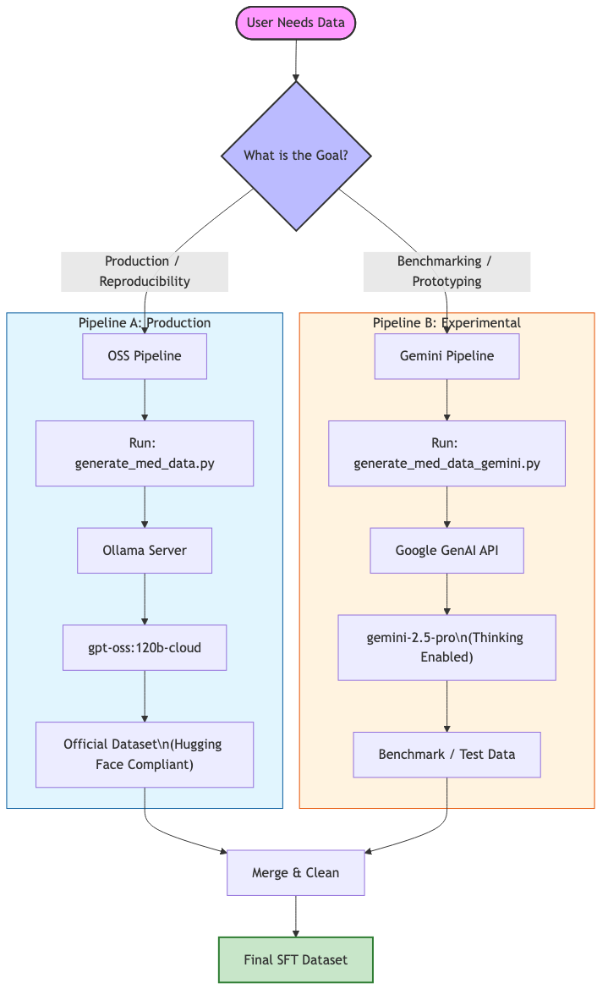
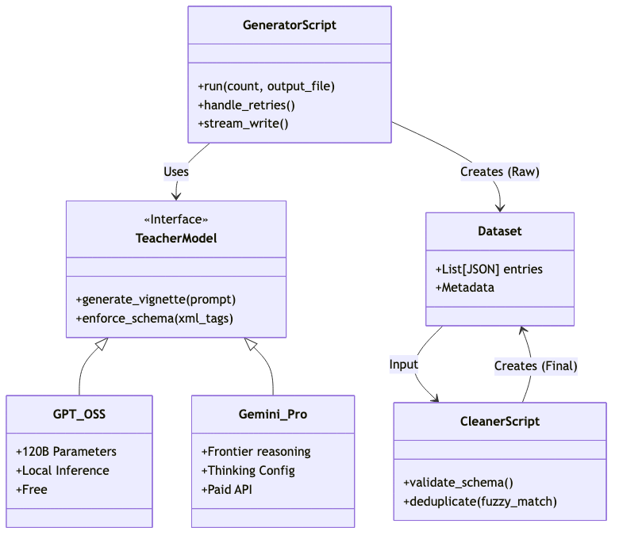

# Data Generation Architecture: OSS vs. Gemini

## 1. Introduction: The Hybrid Generation Strategy

**What is it?**
DIPG Safety Gym utilizes a "Teacher-Student" approach for synthetic data generation. A powerful "Teacher" model generates complex clinical vignettes (including reasoning chains and safety pitfalls), which are then used to train smaller "Student" models or to benchmark safety systems.

**Why is it important?**
Medical safety data is scarce and expensive to label manually. Synthetic generation allows us to create diverse, high-fidelity datasets that target specific safety failure modes (e.g., hallucinations, unsafe advice) without compromising patient privacy.

**The Two Paths**
The project currently supports two distinct generation pipelines:
1.  **Production (OSS):** The standard, reproducible path using open-source models.
2.  **Experimental (Gemini):** A high-capability path using Google's frontier models.

---

## 2. Pipeline A: The Open Source Standard (Production)

**What is it?**
This is the primary pipeline for the project. It uses `gpt-oss:120b-cloud` (hosted via Ollama) to generate the official datasets found on Hugging Face.

**Role**
*   **Standardization:** Ensures that the dataset can be reproduced by anyone with sufficient local hardware or a standardized cloud instance, without relying on proprietary APIs.
*   **Compliance:** Fully aligns with open-science principles.

**Key Characteristics**
*   **Strict Schema Adherence:** Tuned to produce perfect XML tags (`<think>`, `<proof>`, `<answer>`).
*   **Cost:** Free (if running locally or on owned hardware).
*   **Script:** `scripts/generate_med_data.py`

**When to use it:**
*   You want to reproduce the official dataset.
*   You are contributing to the project and want your data to be accepted upstream.
*   You need to generate large volumes of data without API costs.

---

## 3. Pipeline B: The Experimental Frontier (Gemini)

**What is it?**
An alternative pipeline leveraging Google's **Gemini 2.5 Pro** model, specifically utilizing its "Thinking" capabilities.

**Role**
This pipeline serves as a "quality benchmark" and a research sandbox. It allows developers to test:
*   Standardizing prompts against a state-of-the-art reasoning model.
*   Comparing the reasoning depth of OSS models against frontier proprietary models.
*   Rapidly generating complex "Reasoning" or "needle-in-a-haystack" examples that might stump smaller open models.

**Key Characteristics**
*   **Advanced Reasoning:** Uses the `thinking_config` API to budget tokens for explicit thought generation.
*   **Speed:** fast generation for small batches.
*   **Cost:** Incurs usage fees ($ per 1M tokens) and requires a `GOOGLE_API_KEY`.
*   **Script:** `scripts/generate_med_data_gemini.py`

**When to use it:**
*   You are prototyping new prompt strategies.
*   You want to create a "Gold Standard" subset to evaluate other models against.
*   You have access to a Google Cloud API key and budget.

---

## 4. Architecture Comparison Matrix

| Feature | OSS Pipeline (Production) | Gemini Pipeline (Experimental) |
| :--- | :--- | :--- |
| **Primary Model** | `gpt-oss:120b-cloud` | `gemini-2.5-pro` |
| **Inference Engine** | Local / Ollama | Google GenAI API |
| **Cost** | Compute Time (GPU) | Per-Token API Cost ($) |
| **Reproducibility** | High (Open Weights) | Medium (Model updates/deprecation) |
| **Main Script** | `generate_med_data.py` | `generate_med_data_gemini.py` |
| **Ideal Use Case** | Mass Dataset Generation | Benchmarking / Prototyping |

---

## 5. Summary Recommendation

*   **Default to the OSS Pipeline** for all standard development, training, and data submission tasks. It is the "source of truth" for the DIPG Safety Gym.
*   **Use the Gemini Pipeline** only when you need to validate the quality of the OSS generation or when exploring new, complex reasoning tasks that require frontier-level capabilities.
